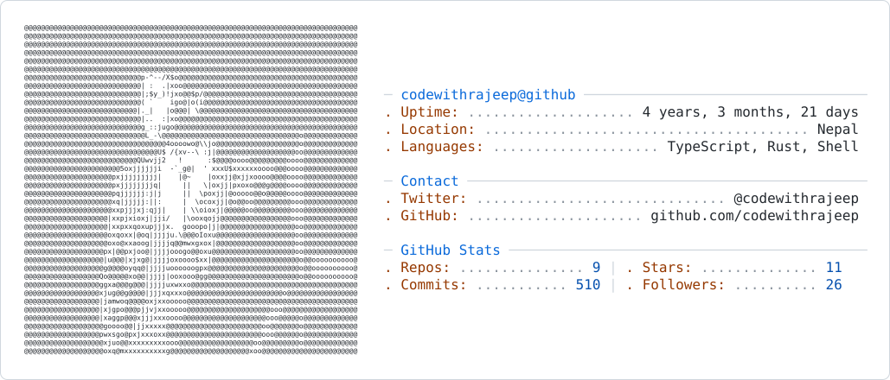

<!-- If you win, you live. If you lose, you die. If you don't fight, you can't win. -->

  <!-- Theme-aware banner -->
  <picture>
    <source media="(prefers-color-scheme: dark)" srcset="dark_mode_80.svg">
    <source media="(prefers-color-scheme: light)" srcset="light_mode_80.svg">
    
  </picture>
  
    
  
  <h3>Hi there! </h3>
  
I'm <strong>Rajeep Gadal</strong>, a Backend Software Engineer from Nepal 🇳🇵

  
  <a href="https://linkedin.com/in/codewithrajeep">LinkedIn</a> · 
  <a href="https://rajeepgadal.com.np">Portfolio</a> · 
  <a href="https://codewithrajeep.vercel.app">Alt Portfolio</a> · 
  <a href="mailto:rajeepgadal@gmail.com">Email</a> · 
  <a href="https://instagram.com/codewithrajeep">Instagram</a>

---

### About Me

I started out building static frontends, but the moment I connected a database and made a server talk to a website, I was hooked. I realized I didn't just want to build interfaces; I wanted to build the logic and systems behind them.

Today, I'm a Backend Software Engineer from Nepal. I love optimizing queries, studying architecture patterns, and bridging the gap between clean code and production. Lately, I've been diving deep into DevOps—getting comfortable with Linux, Docker, and AWS—because I want to build systems that don't just work in development, but thrive in production.

When I'm not coding, you'll find me deep down an F1 rabbit hole. As a Ferrari fan, I've mastered the art of patience (waiting for that next race win or championship). I'm also a non-fiction reader, currently fascinated by neuroplasticity and how we can rewire our brains through consistency—after all, *"those neurons that fire together, wire together."*

I fail, I learn, I rebuild. Whether it's a complex backend system or personal habits, I love the process of iterating until it works.

---

### Tech Stack

**Languages & Core**  
`TypeScript` · `Node.js` · `Rust` (learning for desktop apps) · `JavaScript` · `Shell`

**Backend & Databases**  
`PostgreSQL` · `Redis` · `Prisma` · `BullMQ`

**DevOps & Infrastructure**  
`Docker` · `Linux (Ubuntu)` · `AWS` (learning) · `GitHub Actions`

**Current Focus**  
`System Design` · `Production Deployments` · `Clean Architecture`

---

### Featured Projects

#### [Hookman — Webhook Delivery Service](https://github.com/codewithrajeep/hookman-backend)
*The Problem:* While watching AWS on-call engineers and monitoring status pages, I noticed how critical real-time uptime and event delivery are.
*The Solution:* Built a production-grade webhook delivery service that pings endpoints, monitors uptime, and ensures reliable event delivery using dead-letter queues.
*Tech:* TypeScript, Node.js, Redis, BullMQ.

#### [Pulseboard — Real-time Monitoring](https://github.com/codewithrajeep/pulseboard-backend)
*The Problem:* I wanted to move beyond standard CRUD applications and understand how real-time systems handle data under heavy load.
*The Solution:* Created a backend monitoring platform featuring Redis rate limiting, distributed locking, and Dockerized deployment via GitHub Actions CI/CD.
*Tech:* TypeScript, PostgreSQL, Redis, Docker.

---

  <i>Let's build something great together.</i>

